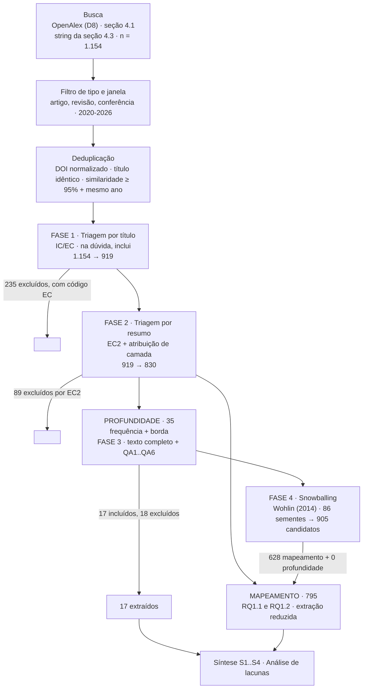

# Protocolo de Revisão Sistemática da Literatura

**Título provisório:** Customização Arquitetural de Redes Neurais Convolucionais para Detecção Forense de Adulteração em Imagens de Documentos: Uma Revisão Sistemática da Literatura

**Versão:** 1.1
**Status:** busca, fases 1 a 4, extração, síntese S1 a S4 e análise de sensibilidade concluídas; desvios sancionados pelo orientador em 2026-09-30; relatório final em redação

> **Nota sobre este documento.** Descreve o método e registra a execução. Toda diferença entre o método aprovado e o executado está na Tabela 6, com data e justificativa. Redigido em português por ser documento de trabalho.
>
> **Convenção de abreviaturas.** Cada sigla é expandida na primeira ocorrência. IC significa critério de inclusão, EC critério de exclusão, QA critério de avaliação de qualidade, RQ pergunta de pesquisa, V ameaça à validade, D decisão de desenho, e o prefixo S identifica um estudo no corpus.

---

## 0. Decisões de desenho

Nove decisões de desenho (D) orientam o método e ficam registradas em conjunto. O racional de cada uma está na seção indicada.

**D5, D8 e D9 alteram o método de forma substantiva.** As três constam da Tabela 6, com a justificativa que as motivou, e foram sancionadas pelo orientador em 2026-09-30.

| # | Decisão adotada | Racional em |
|---|---|---|
| D1 | RQ1.3 formulada para **testar** a lacuna L3, não para confirmá-la | Seções 2.1 e 3; ameaça V4 |
| D2 | Somente material arbitrado; preprints e repositórios de preprint fora | IC4, EC5, seção 10 |
| D3 | Faces e deepfake dentro do escopo, ao lado da forense documental | Seção 4.2; ameaça V5 |
| D4 | Janela de 2020 a 2026 | Seção 4.5 |
| D5 | Triagem, extração e síntese conduzidas pelo autor com apoio de ferramenta de inteligência artificial, sem calibração interavaliadores humana | Seção 10.2; ameaças V2 e V7 |
| D6 | Estudos secundários fora da contagem de primários, retidos para snowballing | EC4; fase 4 |
| D7 | ScienceDirect particionado em quatro consultas. **Aplicável apenas a uma replicação nas bases comerciais** | Apêndice A.1 |
| D8 | Busca executada exclusivamente no OpenAlex, por interface de programação de aplicações (API) pública | Seção 4.1; ameaça V1 |
| D9 | Síntese estratificada em duas camadas: mapeamento amplo e revisão focada | Seção 3.1; ameaça V9 |

A D1 é a de maior consequência: a revisão foi desenhada de modo que possa derrubar a afirmação de originalidade do estudo primário. O compromisso assumido está na nota ao fim da seção 2.1 e na ameaça V4.

---

## 1. Resumo estruturado

**Contexto.** Redes neurais convolucionais (CNN, do inglês *convolutional neural network*) são a família dominante de arquiteturas para detecção de adulteração em imagens, mas backbones projetados para classificação de conteúdo tendem a suprimir exatamente os sinais de alta frequência e as descontinuidades de borda onde residem os vestígios forenses. Isso motivou uma linha de trabalhos que customizam a arquitetura, seja substituindo operações internas, seja acoplando módulos externos ou ramos paralelos de processamento. Essas propostas são publicadas de forma dispersa, avaliadas em conjuntos de dados heterogêneos e raramente comparadas entre si sob um mesmo protocolo.

**Objetivo.** Identificar, classificar e sintetizar a evidência existente sobre estratégias de customização arquitetural de CNN para detecção forense de adulteração em imagens, com ênfase em imagens de documentos, caracterizando onde intervêm na rede, que domínios de representação exploram, como fundem sinais de domínios distintos e sob que protocolos são avaliadas.

**Método.** Segue as diretrizes de Kitchenham e Charters (2007) para revisões sistemáticas em engenharia de software, com avaliação de qualidade adaptada de Dybå e Dingsøyr (2008), snowballing conforme Wohlin (2014) e estratificação da síntese conforme Petersen et al. (2008, 2015). Janela de janeiro de 2020 a dezembro de 2026.

**Resultados esperados.** Uma taxonomia das estratégias de customização por ponto de intervenção; um mapeamento entre domínios de representação e operadores de fusão; uma matriz de combinação identificando quais pares de estratégias já foram integrados no mesmo backbone e quantos estudos mediram a interação entre elas em vez do efeito individual; e um quadro de evidência sobre protocolos de avaliação, generalização entre conjuntos de dados e custo computacional.

**Palavras-chave:** detecção de adulteração em imagens; forense documental; customização arquitetural; domínio da frequência; atenção em bordas; revisão sistemática.

---

## 2. Contexto e motivação

A detecção automatizada de adulteração em documentos digitais tem impacto econômico direto em saúde suplementar, crédito e verificação de identidade. Du Preez et al. (2025), revisando 137 artigos de duas décadas, identificam a fraude cometida por prestadores como a mais prevalente em sinistros de saúde, incidindo sobre datas, códigos de procedimento e valores financeiros, e apontam o desequilíbrio extremo de classes como um dos principais desafios técnicos.

No plano arquitetural, Guo et al. (2023) documentam a limitação que motiva esta revisão: redes treinadas com objetivo de classificação de conteúdo aprendem representações enviesadas para identidade e forma, suprimindo a informação de alta frequência onde os vestígios de manipulação se manifestam. Duas famílias de resposta emergiram:

1. **Modificação da operação interna.** Substituir a convolução padrão por operadores que decompõem e interagem representações espaciais e de frequência ao longo da rede (Guo et al., 2023).
2. **Acoplamento de módulos externos.** Adicionar blocos plug-in que amplificam características forenses sem alterar a topologia base, como os módulos de atenção e concatenação de borda de Bae et al. (2025).

Guevara et al. (2026) argumentam que nenhum domínio isolado cobre o espectro completo de artefatos deixados por diferentes técnicas de adulteração, e apontam a fusão de múltiplos domínios como a estratégia mais efetiva. Essa recomendação aparece como orientação geral, sem sistematização de quais combinações concretas já foram testadas nem sob que evidência.

### 2.1 Lacunas de conhecimento

**L1. Ausência de taxonomia por ponto de intervenção.** As propostas são descritas nos termos de cada autor (substituição de convolução, módulo plug-in, ramo paralelo, fluxo duplo), sem vocabulário comum que permita comparar *onde* na rede cada customização atua.

**L2. Fusão multi-domínio recomendada, mas não sistematizada.** A literatura converge na recomendação de combinar domínios, mas não há inventário de quais operadores de fusão são empregados nem sob que condições a fusão é incondicional ou modulada.

**L3. Combinações avaliadas isoladamente.** Estudos que propõem uma customização geralmente a avaliam contra um backbone padrão. Não está estabelecido quantos combinam customizações de domínios distintos no mesmo backbone e, crucialmente, quantos medem a **interação** entre elas em vez de somar efeitos individuais reportados separadamente.

> **Nota de transparência.** A lacuna L3 é a que sustenta a afirmação de originalidade do estudo primário associado a este protocolo. A revisão foi desenhada para testá-la, não para confirmá-la. Se a busca identificar trabalhos que já combinam e medem interação entre customização de borda e customização de frequência, esse achado deve ser reportado e a afirmação de originalidade revista de acordo. Ver ameaça V4.

---

## 3. Perguntas de pesquisa

**RQ1 (principal).** Como a literatura customiza arquiteturas de redes neurais convolucionais para detecção forense de adulteração em imagens?

- **RQ1.1 (o quê e onde).** Quais estratégias de customização arquitetural têm sido propostas e em que ponto da rede elas intervêm?
- **RQ1.2 (com que sinal).** Que domínios de representação essas customizações exploram, e por meio de quais operadores os sinais de domínios distintos são fundidos?
- **RQ1.3 (combinadas).** Existem estudos que integram customizações de domínios distintos sobre um mesmo backbone, e quantos avaliam a interação entre elas em vez do efeito individual de cada uma?
- **RQ1.4 (com que evidência).** Sob quais conjuntos de dados, métricas e protocolos de validação essas customizações são avaliadas, e que evidência existe sobre generalização entre conjuntos de dados e custo computacional de inferência?

A progressão segue a cadeia **estratégias e posição → sinal e fusão → combinação e interação → qualidade da evidência.** RQ1.3 endereça diretamente a lacuna L3.

### 3.1 Estratificação da síntese em duas camadas (D9)

A busca recupera mais de mil registros, e a triagem por resumo deixaria várias centenas de estudos para leitura de texto completo, volume incompatível com o cronograma e com o acesso disponível.

**Diagnóstico.** O EC2 discrimina pouco porque o bloco de customização da string já selecionou, na busca, exatamente os trabalhos que propõem variação arquitetural. Pedir ao EC2 que corte por ausência de customização é pedir que desfaça o que a string fez. A densidade de variações arquiteturais é um dado do campo, não um defeito da estratégia.

**Desenho adotado.**

| | Camada de mapeamento | Camada de profundidade |
|---|---|---|
| Responde | RQ1.1 e RQ1.2 | RQ1.3 e RQ1.4 |
| População | todos os que sobrevivem aos critérios | subconjunto com indicação positiva |
| Fonte | metadados e resumo | texto completo |
| Extração | formulário reduzido (Tabela 3a) | formulário completo (Tabela 3b) |
| Produto | taxonomia, tabelas de frequência, gráfico de bolhas | matriz de combinação e interação, quadro de evidência |

**Critério de promoção à camada de profundidade.** O estudo combina customização no domínio da **frequência** com customização no domínio da **borda**, que é exatamente o par que o estudo primário associado combina (ramo de transformada discreta do cosseno mais módulos de borda). A promoção é por **sinal positivo**, não por impossibilidade de exclusão. O vocabulário de detecção definido abaixo **não é critério de elegibilidade**: todo estudo que satisfaz os critérios de inclusão e de exclusão integra a revisão, na camada de mapeamento. O vocabulário é o mecanismo operacional que **prioriza**, entre os estudos elegíveis, quais são lidos em profundidade.

O par é exato por alinhamento com a RQ1.3: a pergunta que a camada de profundidade existe para responder é sobre a combinação que o estudo primário propõe. Estudos que combinam frequência com ruído, sem borda, testam outra combinação e permanecem na camada de mapeamento, onde respondem a RQ1.1 e RQ1.2.

**Vocabulário de detecção de domínio.** A atribuição de camada é regra mecânica sobre título e resumo. **Frequência:** `frequenc`, `DCT`, `discrete cosine`, `wavelet`, `fourier`, `spectral`, `spectrum`, `high-frequency`. **Borda:** `edge` acompanhado de termo de módulo (`edge attention`, `edge-aware`, `edge-guided` e congêneres), `boundary`, `contour`, `sobel`, `canny`, `laplacian` ou `edge loss`. **Ruído:** `noise`, `SRM`, `PRNU`, `noiseprint`, `constrained conv`, `noise residual`. Dois termos frequentes ficam deliberadamente de fora: `gradient`, que na área designa o gradiente descendente e não representação de borda, e `residual` isolado, que designa a conexão residual do ResNet e não domínio de ruído.

**Custo declarado do vocabulário fechado e verificação.** A lista de borda é fechada e, por isso, introduz falso negativo. Uma lista aberta, com qualquer ocorrência de `edge`, `boundary`, `contour`, `sobel`, `canny` ou `laplacian` (sem `gradient` e `residual`), elevaria a camada de profundidade de 35 para 56 estudos no corpus primário e acrescentaria 2 do snowballing. Adotou-se a lista fechada, trocando falso positivo por falso negativo, e o custo foi medido: os 23 estudos que a lista aberta acrescentaria foram classificados por leitura do resumo. A maioria é falso positivo léxico (*edge devices*, *cutting-edge*, contorno da região localizada); dois a três combinam de fato frequência e borda, e nenhum deles é do domínio documental. O único estudo documental do grupo combina frequência e ruído. Os três precedentes de ablação cruzada identificados na síntese (S3) são promovidos sob as duas listas.

**A ablação não é critério de triagem.** Poderia parecer natural exigir, para promoção, que o estudo anuncie ablação. A medição desaconselha: **apenas 6% dos resumos do corpus (44 de 782) mencionam ablação**. Filtrar por ela na triagem selecionaria convenção de escrita de resumo, não rigor metodológico, e descartaria sistematicamente estudos que fizeram ablação sem anunciá-la. A ablação entra como **campo de extração** (Tabela 3b), preenchido a partir do texto completo, que é onde a informação existe de fato.

**Registros sem resumo.** Entram no mapeamento com os campos que seus metadados permitem e só são promovidos por indicação positiva. A ausência de metadado não leva um registro à etapa mais cara: o ônus é demonstrar que o estudo deve subir, não que deve sair.

**Filiação metodológica.** O desenho corresponde a um estudo de mapeamento sistemático combinado a uma revisão focada, conforme Petersen et al. (2008, 2015), da mesma família metodológica das diretrizes de Kitchenham e Charters (2007). Os demais elementos de uma revisão sistemática estão presentes: protocolo aprovado antes da busca, string declarada, critérios numerados, funil, avaliação de qualidade, snowballing e ameaças à validade.

---

## 4. Estratégia de busca

### 4.1 Fonte de informação

A busca bibliográfica é realizada exclusivamente no **OpenAlex**, índice bibliográfico aberto e multidisciplinar, com metadados estruturados, que indexa publicações de diversos veículos também presentes nas bases de referência da área, incluindo IEEE Xplore, ACM Digital Library e ScienceDirect. A consulta é submetida por interface de programação de aplicações (API) pública, sobre os campos de título e resumo.

**Justificativa.** IEEE Xplore e ScienceDirect exigem chave de API com vinculação institucional, a ACM Digital Library não expõe API pública, e a execução pelas interfaces web depende de sessão autenticada. O OpenAlex é, além disso, reprodutível: a consulta é um endereço, e o mesmo endereço na mesma data devolve o mesmo conjunto, ao contrário de resultados de interface, que variam com ranqueamento e versão da plataforma. Por ser aberto, permite que qualquer leitor reexecute a consulta sem credencial institucional. A cobertura multidisciplinar permite recuperar publicações de diferentes veículos em uma única fonte, e o filtro por tipo de publicação restringe o universo a artigos de periódico, revisões e artigos de conferência. O filtro não garante, por si, revisão por pares: a condição de arbitragem exigida por IC4 é verificada na seleção, com EC5 aplicado na triagem e na leitura de texto completo sempre que o veículo ou o documento indicar material não arbitrado.

**Limitação.** O corpus não é o mesmo que as bases comerciais produziriam, e estudos indexados apenas nelas podem ficar de fora. A indexação de resumos é incompleta: Qian et al. (2020), do conjunto de validação, não tem resumo indexado e é recuperado apenas por correspondência de título. Ver ameaça V1.

**Mitigação.** O snowballing da fase 4 é **obrigatório**, por ser o mecanismo que recupera estudos perdidos por indexação deficiente. O conjunto quasi-gold funciona como verificação de piso da cobertura. Para uma eventual replicação nas bases comerciais, as strings adaptadas estão no Apêndice A.

**Repositórios de preprint não são consultados**, por coerência com IC4 e EC5. A consequência sobre o estudo primário está na seção 10.1.

### 4.2 Estrutura PICOC

PICOC designa população, intervenção, comparação, desfecho e contexto.

| Elemento | Definição |
|---|---|
| **População** | Imagens digitais sujeitas a adulteração, com ênfase em imagens de documentos; o domínio adjacente de faces é incluído por compartilhar as mesmas famílias de técnicas arquiteturais |
| **Intervenção** | Customizações arquiteturais de CNN: módulos plug-in, ramos paralelos, substituição de operadores convolucionais, processamento em domínio de frequência |
| **Comparação** | Backbones CNN padrão, sem customização arquitetural |
| **Desfecho** | Desempenho de detecção, generalização entre conjuntos de dados, custo computacional de inferência |
| **Contexto** | Forense de imagem digital e detecção de fraude documental |

### 4.3 String de busca

Dois blocos conceituais ligados por um operador AND, executados em duas consultas que diferem apenas no bloco de tarefa.

**Consulta primária** (forense documental e de imagem em geral):

```
(  "image forgery" OR "image tampering" OR "image manipulation detection"
   OR "document forgery" OR "document tampering" OR "tampered text"
   OR "splicing detection" OR "copy-move" OR "image forensics"  )
AND
(  "frequency" OR "discrete cosine transform" OR "DCT" OR "high-frequency"
   OR "edge attention" OR "two-stream" OR "dual-stream"  )
```

**Consulta secundária** (domínio de faces, conforme D3): segundo bloco idêntico; o primeiro é substituído por `("deepfake detection" OR "face forgery")`.

**Racional.** O bloco de tarefa delimita a atividade forense com as variantes terminológicas que a literatura usa de forma parcialmente intercambiável. O bloco de customização filtra pelas famílias sob investigação, reunindo termos de domínio de representação e de posição arquitetural. A discriminação fina fica nos critérios de inclusão e exclusão, e **não** em blocos adicionais na string.

**Termos deliberadamente ausentes.** Nomes próprios de arquiteturas (SFIConv, EA-EC, DocTamper, F3-Net) não integram a string primária: termos cunhados por um artigo individual recuperam esse artigo e seus citantes, não a literatura do problema. O lugar deles é o snowballing para frente (fase 4).

### 4.3.1 Racional das escolhas da string

**Sem bloco de abordagem neural.** Um bloco `("convolutional neural network" OR "CNN" OR "deep learning")` parece inofensivo por ser amplo, mas derruba estudos válidos: o resumo indexado de Guo et al. (2023), publicado em IEEE Transactions on Information Forensics and Security e integralmente dedicado a uma modificação de operador convolucional, não contém nenhum dos três termos. Artigos da área tratam a natureza neural do método como pressuposto e não a anunciam no resumo, de modo que esse bloco opera como filtro de recall sem ganho de precisão.

**`"frequency"` isolado, não `"frequency domain"`.** A forma composta não recupera Qu et al. (2023), cujo resumo nomeia o módulo como *Frequency Perception Head*, nem Qian et al. (2020), cujo título usa *Frequency-Aware*. O termo isolado amplia o volume, custo aceito em favor do recall.

**Anais de conferência incluídos.** Em ciência da computação a conferência é o veículo principal; sem os anais, a busca perde CVPR, ECCV e ICCV. Dos registros recuperados, 482 são de anais, 42% do corpus.

**Bloco de customização enxuto.** Termos genéricos como `"attention module"`, `"plug-in module"`, `"feature fusion"` e `"backbone modification"` não integram a string: não recuperam nenhum registro relevante que os sete termos adotados já não recuperem, e acrescentá-los eleva o corpus de 1.154 para 1.423.

### 4.3.2 Análise de sensibilidade da string

Para verificar se a string é mais ampla do que o necessário, foram testadas variantes mais restritivas, todas submetidas à regra de decisão da seção 4.4 e medidas não apenas pelo volume recuperado, mas pela **evidência preservada**: quantos dos três precedentes de ablação cruzada frequência+borda identificados na síntese (S0059, S0272 e S0280) cada variante ainda recupera. Registro em `scripts/rsl_calibra_string.py` e `scripts/rsl_v2_comparacao.py`.

| Variante | Corpus | Precedentes preservados | Perdidos |
|---|---|---|---|
| Com os quatro termos genéricos (seção 4.3.1) | 1.423 | 3 de 3 | nenhum |
| **String adotada** | **1.154** | **3 de 3** | **nenhum** |
| + bloco de detecção obrigatório | 1.090 | 2 de 3 | S0272 |
| + bloco de contribuição (`"propose"`, `"novel"`) | 960 | 2 de 3 | S0280 |
| + bloco de avaliação empírica | 886 | 2 de 3 | S0280 |
| Todos os blocos acima combinados | 740 | 1 de 3 | S0272, S0280 |

**Blocos adicionais foram testados e rejeitados.** Exigir por conjunção um sinal de detecção, de contribuição ou de avaliação empírica corta mais volume, mas **cada um deles, mesmo isolado, derruba ao menos um dos precedentes que sustentam a resposta à RQ1.3**. O resultado é informativo: o campo não anuncia no resumo nem a natureza neural do método (seção 4.3.1) nem a existência de avaliação empírica, de modo que blocos de conjunção operam como filtro de recall sem ganho de precisão proporcional. A variante mais restritiva, de 740 registros, deixaria só um dos três precedentes e faria a lacuna L3 parecer maior do que a evidência sustenta.

### 4.4 Conjunto de validação da busca (quasi-gold standard)

A string é validada contra um conjunto de artigos que a busca **deve obrigatoriamente** recuperar.

| # | Estudo | Veículo | Papel |
|---|---|---|---|
| V1 | Bae et al. (2025), Enhancing Document Forgery Detection with Edge-Focused Deep Learning | Symmetry | Módulo plug-in, domínio de borda |
| V2 | Guo et al. (2023), Constructing New Backbone Networks via Space-Frequency Interactive Convolution | IEEE TIFS | Substituição de operador, domínio de frequência |
| V3 | Qu et al. (2023), Towards Robust Tampered Text Detection in Document Image | CVPR | Forense documental, conjunto de dados de referência |
| V4 | Qian et al. (2020), Thinking in Frequency: Face Forgery Detection by Mining Frequency-Aware Clues | ECCV | Frequência aplicada a faces, trabalho seminal |

**Estudos secundários não integram o conjunto.** Raza et al. (2026) e Guevara et al. (2026) são referências centrais, mas seriam excluídos por EC4. Um conjunto quasi-gold não pode conter estudo que os próprios critérios rejeitam, sob pena de calibrar a string para recuperar o que a revisão descartaria. O caso de Guevara et al. (2026) é ilustrativo: seu resumo não contém nenhum termo de customização arquitetural porque o artigo é uma pesquisa geral sobre detecção de imagens sintéticas. Não falha por defeito da string, mas por estar fora do escopo. Os dois seguem citáveis e alimentam o snowballing.

**Regra de decisão.** A busca deve recuperar **os quatro**. Recuperando menos, a string é revisada antes da execução definitiva.

**Resultado.** Sobre o OpenAlex: consulta primária 462, secundária 714, sobreposição 22, corpus único **1.154**, com os quatro estudos do conjunto recuperados. A separação entre as consultas é mantida no relato, de modo que o funil possa ser lido por domínio, conforme a mitigação da ameaça V5.

**Poda por metadado não é aplicável.** Considerou-se restringir o corpus a registros com editora arbitrada reconhecida, o que cortaria mais da metade. A opção foi **rejeitada**: cerca de 40% dos registros não têm editora informada no índice, e esse conjunto inclui os anais de CVPR, ECCV e ICCV. O filtro derrubava Qu et al. (2023), do próprio conjunto de validação. A eliminação de material fora de escopo fica integralmente a cargo das fases 1 e 2.

### 4.4.1 Caracterização do corpus recuperado

Medições sobre os registros recuperados. São o que limita, na prática, o que cada fase consegue decidir.

| Propriedade | n | % |
|---|---|---|
| Registros no corpus | 1.154 | 100,0 |
| **Sem resumo indexado** | **334** | **28,9** |
| Acesso fechado | 725 | 62,8 |
| Acesso aberto em alguma modalidade | 429 | 37,2 |

Tentou-se completar os resumos ausentes pelo Crossref: em amostra de 25 registros com identificador de objeto digital (DOI), **nenhum** tinha resumo depositado. Não há correção por via automatizada. O tratamento desses registros é o descrito na seção 3.1.

### 4.5 Janela temporal e filtro de tipo

**Janela:** publicações a partir de janeiro de 2020; o filtro da consulta vai até dezembro de 2026, de modo que a cobertura efetiva termina na data da busca (23 de setembro de 2026). O limite inferior preserva os trabalhos seminais que fundamentam as técnicas comparadas, entre eles Qian et al. (2020), e mantém o volume de triagem administrável. Referências clássicas anteriores (por exemplo, a formulação original da transformada discreta do cosseno por Ahmed et al., 1974) permanecem citáveis como fundamentação do estudo primário, mas não integram o corpus.

**Tipo de conteúdo:** artigos de periódico, artigos de revisão e artigos de anais de conferência (seção 4.3.1).

---

## 5. Critérios de inclusão e exclusão

### 5.1 Critérios de inclusão

| ID | Critério |
|---|---|
| **IC1** | Estudos publicados a partir de janeiro de 2020 (cobertura efetiva até a data da busca, 23 de setembro de 2026) |
| **IC2** | Estudos que propõem, modificam ou avaliam arquiteturas de redes neurais para detecção de adulteração, falsificação ou geração sintética em imagens |
| **IC3** | Estudos que descrevem explicitamente a customização arquitetural em nível suficiente para extração |
| **IC4** | Estudos submetidos a revisão por pares, publicados em periódico ou em anais de conferência |
| **IC5** | Estudos que reportam avaliação empírica quantitativa, com métrica de detecção sobre conjunto de dados identificado |

### 5.2 Critérios de exclusão

| ID | Critério |
|---|---|
| **EC1** | Não abordam detecção de adulteração, falsificação ou geração sintética em imagens |
| **EC2** | Aplicam arquiteturas existentes sem customização arquitetural |
| **EC3** | Exclusivamente vídeo, áudio ou texto, sem componente de imagem estática |
| **EC4** | Estudos secundários. Retidos em lista separada como insumo para o snowballing |
| **EC5** | Publicações não arbitradas, com menos de 4 páginas, editoriais, tutoriais e resumos estendidos |
| **EC6** | Sem texto completo disponível |
| **EC7** | Não publicados em inglês ou português |
| **EC8** | Publicações duplicadas, retendo-se a versão mais completa |

**Nota sobre EC2.** É o critério de maior carga de julgamento. Regra operacional: exclui-se quando a contribuição é de dados, treinamento ou pós-processamento e o grafo computacional é o de um backbone publicado (método clássico sem rede neural, ensemble de modelos prontos, estudo comparativo de arquiteturas existentes, artigo de conjunto de dados ou benchmark). Inclui-se quando há alteração no grafo: substituição de operador, inserção de módulo, ramo adicional ou mudança no caminho de fusão.

---

## 6. Processo de seleção



### Fase 1: Triagem por título
Avaliação pelo título contra IC e EC. Elimina-se o claramente fora de escopo, com registro do código de exclusão. Aplica-se "na dúvida, inclui" (Kitchenham e Charters, 2007, seção 6.2.2) a incerteza genuína, não a estudos cujo título já evidencia domínio não forense.

### Fase 2: Triagem por resumo e atribuição de camada
Dois julgamentos por registro: aplicação do EC2, e atribuição à camada de mapeamento ou de profundidade segundo o critério da seção 3.1.

**Confiabilidade.** Não há calibração interavaliadores humana (D5). A triagem é conduzida pelo autor com apoio de ferramenta de IA, e cada exclusão registra obrigatoriamente o código EC que a motivou, o que torna a decisão auditável registro por registro. Declarado nas ameaças V2 e V7.

### Fase 3: Leitura completa e avaliação de qualidade
Aplicada **somente à camada de profundidade**. Os estudos são lidos integralmente e avaliados pela lista da seção 7. A avaliação de qualidade caracteriza rigor e alimenta a análise de sensibilidade, **mas não elimina estudos**. Exclusões nesta fase decorrem apenas de critérios verificáveis no texto completo (tipicamente EC2 e EC6).

### Fase 4: Snowballing
**Obrigatório** (ver 4.1). Para trás (listas de referências) e para frente (citantes) sobre os estudos da camada de profundidade, conforme Wohlin (2014). Os estudos secundários retidos por EC4 servem de ponto de partida adicional. Os nomes próprios omitidos da string primária são usados aqui como consultas de citação. Novos estudos passam pelas fases 1 a 3.

### Registro de resultados

**Tabela 1a. Funil de seleção, corpus primário**

| Etapa | n |
|---|---|
| Recuperados, consulta primária | 462 |
| Recuperados, consulta secundária | 714 |
| Sobreposição entre consultas | −22 |
| **Corpus único** | **1.154** |
| Após fase 1 (título) | 919 |
| Após fase 2 (resumo, EC2 89) | 830 |
| → camada de mapeamento | 795 |
| → camada de profundidade | 35 |
| Fase 3, texto completo: incluídos (extraídos) | 17 |
| Fase 3, texto completo: excluídos (EC6 14, EC2 4) | 18 |

**Tabela 1b. Funil de seleção, snowballing (fase 4)**

| Etapa | n |
|---|---|
| Sementes (35 profundidade + 51 secundários retidos por EC4) | 86 |
| Referências para trás, únicas | 1.416 |
| Citantes para frente, recuperados | 214 |
| Únicos após remover o que já está no corpus primário | 1.492 |
| **Candidatos dentro da janela e do filtro de tipo** | **905** |
| Exclusões (EC1 157, EC4 78, EC2 29, EC3 13) | 277 |
| → camada de mapeamento | 628 |
| → camada de profundidade | 0 |

**Tabela 1c. Totais combinados (corpus primário + snowballing)**

| Etapa | n |
|---|---|
| Camada de mapeamento, total | 1.423 |
| Camada de profundidade, total | 35 |
| Texto completo extraído, total | **17** |
| Texto completo excluído na fase 3, total | 18 |

**Tabela 2. Distribuição dos critérios de exclusão, corpus primário**

| Critério | Fase 1 | Fase 2 | Fase 3 | Total | Descrição |
|---|---|---|---|---|---|
| EC1 | 28 | 0 | 0 | 28 | Fora do domínio forense |
| EC2 | 0 | 89 | 4 | 93 | Sem customização arquitetural |
| EC3 | 105 | 0 | 0 | 105 | Vídeo, áudio ou texto apenas |
| EC4 | 51 | 0 | 0 | 51 | Estudo secundário |
| EC6 | 0 | 0 | 14 | 14 | Texto completo indisponível |
| EC7 | 4 | 0 | 0 | 4 | Idioma |
| EC8 | 47 | 0 | 0 | 47 | Duplicata |
| **Total** | **235** | **89** | **18** | **342** | 29,6% do corpus |

**Exclusões da fase 3 decididas por leitura.** Quatro das 18 exclusões desta fase são por EC2, identificado apenas no texto completo, e não pelo resumo: três métodos clássicos sem rede neural e um ensemble de modelos prontos. As decisões de exclusão tomadas pelo autor após leitura estão registradas em `dados/_SINALIZACOES_FASE3.md`, com o critério que motivou cada uma.

**Tabela 2b. Distribuição dos critérios de exclusão, snowballing**

| Critério | Fase 1 | Fase 2 | Fase 3 | Total | Descrição |
|---|---|---|---|---|---|
| EC1 | 157 | 0 | 0 | 157 | Fora do domínio forense |
| EC2 | 0 | 29 | 0 | 29 | Sem customização arquitetural |
| EC3 | 13 | 0 | 0 | 13 | Vídeo, áudio ou texto apenas |
| EC4 | 78 | 0 | 0 | 78 | Estudo secundário |
| **Total** | **248** | **29** | **0** | **277** | 30,6% dos candidatos |

As 86 sementes produziram 905 candidatos dentro da janela e do filtro de tipo, todos triados pela fase 1 e, quando aplicável, pela fase 2. Nenhum candidato do snowballing atinge a camada de profundidade sob o critério do par exato: a colheita contribui integralmente para a camada de mapeamento.

**Composição das exclusões.** EC3 concentra detecção de deepfake em áudio, fala, música e voz, que a string recupera porque a literatura usa "deepfake detection" para as duas modalidades. EC1 reúne atribuição de câmera de origem, esteganálise, marca d'água de copyright e detecção de notícias falsas textuais, além de falsos positivos terminológicos: "splice" em fibra óptica e em biologia molecular, "forensics" em análise de isótopos. EC8 revela registros repetidos com identificadores distintos, invisíveis à deduplicação por identificador feita na busca. No snowballing, EC1 e EC4 dominam porque a coleta não tem filtro temático: puxa a bibliografia de infraestrutura que todo artigo da área cita (Swin Transformer, GANs, difusão latente), removida pela triagem por título.

**Planilhas.** O corpus primário está em `dados/v2/triagem.csv` e o snowballing em `dados/v2/fase4_triagem.csv`, planilhas separadas; os números das Tabelas 1b e 2b vêm da segunda.

**Registro auditável.** Cada exclusão da fase 1 está em `dados/fase1_exclusoes.json` e em `scripts/rsl_fase1_vereditos.py`, por identificador e código. As duplicatas em `dados/fase1_duplicatas.json`, com o identificador do registro retido. A atribuição de camadas em `scripts/rsl_v2_pipeline.py` e `dados/v2/camada_profundidade.json`.

### Gestão de referências e deduplicação
Deduplicação por DOI normalizado, título normalizado idêntico, ou similaridade de título igual ou superior a **95% com coincidência de ano**. O limiar é alto porque títulos desta área são formulaicos a ponto de ultrapassarem 85% entre artigos distintos ("An improved **block** based copy-move forgery detection technique" contra "An improved **reduced feature**-based copy-move forgery detection technique"), o que, com limiar de 85%, produz 12 falsos positivos em 71 pares.

---

## 7. Avaliação de qualidade

Aplicada à camada de profundidade. Pontuação: Sim = 1, Parcialmente = 0,5, Não = 0. Máximo 6.

| ID | Critério |
|---|---|
| **QA1** | O estudo examina customização arquitetural para detecção forense de adulteração? |
| **QA2** | Os objetivos estão claramente definidos? |
| **QA3** | O contexto (conjunto de dados, tipo de adulteração, domínio) está adequadamente descrito? |
| **QA4** | A customização é descrita em nível reprodutível, incluindo posição na rede, operações e hiperparâmetros? |
| **QA5** | Os achados são validados com baseline de comparação, estudo de ablação, teste estatístico ou avaliação entre conjuntos de dados? |
| **QA6** | O estudo contribui com evidência aplicável à comparação entre estratégias de customização? |

**Finalidade.** Avaliação descritiva: caracteriza o rigor e a reprodutibilidade de cada estudo e sustenta a análise de sensibilidade, sem atestar a qualidade da literatura. É complementada, na síntese, por indicadores específicos do desenho que a RQ1.3 exige (quatro células, cruzamento em mais de um conjunto de dados, dispersão entre execuções, teste estatístico e custo). **Não exclui.** Todos os estudos que passam pelos critérios são retidos independentemente do escore, o que permite reportar o perfil de qualidade da base de evidência.

---

## 8. Extração de dados

### Tabela 3a. Formulário reduzido (camada de mapeamento)

Preenchido a partir de metadados e resumo. Campo não disponível recebe `nao_informado`, nunca inferido.

| Campo | Atende |
|---|---|
| Identificador, dados bibliográficos, tipo de veículo | Todas |
| Domínio de aplicação (documento, face, imagem natural, misto) | RQ1.1 |
| Estratégia de customização (categoria da taxonomia) | RQ1.1 |
| Ponto de intervenção | RQ1.1 |
| Domínios de representação explorados | RQ1.2 |
| Operador de fusão, quando declarado | RQ1.2 |
| Fonte da caracterização (resumo ou apenas título) | V9 |

### Tabela 3b. Formulário completo (camada de profundidade)

Preenchido a partir do texto completo. Inclui todos os campos da Tabela 3a, mais:

| Campo | Atende |
|---|---|
| Tipo de adulteração tratada | RQ1.1 |
| Backbone base | RQ1.1 |
| Fusão condicional: modulada por conteúdo ou fixa pela arquitetura? | RQ1.2 |
| Combina múltiplas customizações; quais | RQ1.3 |
| **Avalia interação:** mede o efeito conjunto além dos individuais (ablação cruzada)? | RQ1.3 |
| Par cruzado: quais domínios a ablação de fato cruza | RQ1.3 |
| Conjuntos de dados de avaliação | RQ1.4 |
| Métricas reportadas | RQ1.4 |
| Protocolo de validação (divisão, folds, sementes, seleção de limiar) | RQ1.4 |
| Resultado principal e ganho sobre baseline | RQ1.4 |
| Avaliação entre conjuntos de dados; queda reportada | RQ1.4 |
| Custo computacional (parâmetros, operações, latência, hardware) | RQ1.4 |
| Estudo de ablação; escopo | RQ1.4 |
| Limitações declaradas, escore QA | Todas |

**`Avalia interação` é o campo que responde a RQ1.3** e o que decide a afirmação de originalidade do estudo primário. Vale `sim` **apenas** com ablação cruzada sobre a **presença ou ausência de dois domínios de representação distintos**, cada um isolado como operador próprio, sobre um baseline: o estudo mede nenhum dos dois, A, B e A+B. Vale `parcial` quando falta uma dessas células ou quando um dos domínios nunca é isolado. Vale `nao` quando não há cruzamento. Não bastam: reportar A e B em experimentos separados, variar só a multiplicidade de componentes já presentes, ou cruzar um domínio com um operador que não é domínio de representação (por exemplo, um módulo de fusão multimodal). O campo `par cruzado` registra o que a ablação realmente cruza. Medir as quatro células permite **estimar** a interação, mas não **demonstra sinergia**, o que exigiria repetição e teste estatístico sobre o termo de interação; a síntese distingue combinação, avaliação de interação e sinergia demonstrada.

**Procedimento.** Extração pelo autor a partir do texto completo, com apoio de ferramenta de IA e citação literal obrigatória nos quatro campos de julgamento (`ponto_intervencao`, `operador_fusao`, `avalia_interacao`, `qa4`). Cada estudo é extraído em duas passagens independentes, ambas conduzidas pelo autor com apoio da mesma ferramenta, para medir a estabilidade dos campos de julgamento (seção 10.2).

---

## 9. Síntese de dados

**S1. Taxonomia por ponto de intervenção (RQ1.1).** Classificação segundo onde a customização intervém no grafo computacional, com vocabulário construído indutivamente. Produto: taxonomia e tabela de frequência, com indicação de quantos estudos sustentam cada categoria por resumo e quantos apenas por título.

**S2. Mapeamento domínio versus operador de fusão (RQ1.2).** Tabela cruzada entre domínios explorados e operadores empregados, distinguindo fusão fixa de fusão condicional.

**S3. Matriz de combinação e interação (RQ1.3).** Matriz simétrica cujas células indicam quantos estudos combinam cada par de estratégias sobre um mesmo backbone e, dentre esses, quantos avaliam a interação por ablação cruzada. **É o instrumento que testa a lacuna L3.**

**S4. Quadro de evidência (RQ1.4).** Distribuição de conjuntos de dados, métricas e protocolos; proporção com avaliação entre conjuntos; proporção que reporta custo computacional e em que hardware.

**Análise de sensibilidade.** Duas verificações: as conclusões se sustentam considerando apenas os estudos de maior escore QA? E considerando apenas estudos de periódico, excluindo os de anais? Como 13 dos 17 estudos têm nota máxima, a mediana coincide com o máximo; os cortes usados são QA = 6 e QA ≥ 5,5, calculados com as notas das duas extrações (desvio 19). Resultado em `SINTESE_S3_S4.md`.

---

## 10. Tratamento de literatura não arbitrada

Preprints, relatórios técnicos e teses estão excluídos por IC4 e EC5, e repositórios de preprint não integram a busca. A revisão retrata o estado da arte **arbitrado** do campo.

**Custo assumido.** Em visão computacional o ciclo de publicação é longo e parte da literatura relevante circula como preprint por meses ou anos. Trabalhos recentes ficam fora por status editorial, não por mérito. Refletido na ameaça V3.

### 10.1 Consequência sobre o estudo primário

| Referência | Papel no artigo |
|---|---|
| Wu et al. (2026), AIForge-Doc | Sustenta o resultado de área sob a curva próxima de 0,50 contra fraudes geradas por inteligência artificial generativa |
| Qiao et al. (2025) | Fundamenta o processamento no domínio da frequência sobre a imagem bruta |
| TFR (2023) | Recurso de dados do protocolo experimental |

**Como isso é tratado.** Corpus de revisão e bibliografia são coisas distintas. O corpus é o conjunto sobre o qual a revisão produz evidência sistematizada, restrito a material arbitrado. A bibliografia do artigo permanece livre para citar preprints como fundamentação, o que é prática corrente. O que **não** se pode fazer é apresentar um preprint como achado da revisão: onde o artigo se apoiar nessas três referências, o texto deve deixar claro que é fundamentação externa ao corpus revisado.

### 10.2 Uso de ferramentas de inteligência artificial (D5)

Triagem, extração e síntese foram conduzidas pelo autor com apoio de ferramenta de inteligência artificial (modelo de linguagem), sem calibração interavaliadores humana. A tabela declara, etapa por etapa, onde houve esse apoio e como o resultado foi verificado.

| Etapa | Execução | Verificação |
|---|---|---|
| Redação do protocolo | Autor, com apoio de IA na redação | Orientador |
| Execução da busca | Script `rsl_v2_busca.py` | Reprodutível pelo endereço e data registrados |
| Deduplicação | Script `rsl_dedup.py` | Determinística |
| Fase 1, triagem por título | Autor, título a título, com apoio de IA; código EC registrado em toda exclusão | Registro auditável por identificador |
| Fase 2, atribuição de camada | Regra mecânica por domínio de representação (seção 3.1), em `rsl_v2_pipeline.py` | Determinística; auditável pelo campo `dominios_detectados` |
| Fase 2, EC2 | Autor, por leitura dos resumos dos 169 candidatos de fronteira, com apoio de IA | Registro auditável, com motivo por estudo |
| Fase 3, leitura, QA e extração | Autor, por leitura do texto completo, com apoio de IA no preenchimento do formulário; citação literal obrigatória nos quatro campos de julgamento | Segunda extração independente, sem acesso à primeira (κ de Cohen entre as duas); leitura integral pelo autor dos estudos `sim` |
| Fase 4, snowballing | Autor, com apoio de IA, sob os mesmos critérios do corpus primário | Registro auditável por identificador |
| Síntese | Autor, com apoio de IA no cálculo das tabelas | Recalculável a partir das planilhas |

**Fase 2.** A atribuição de camada é regra mecânica e determinística. O EC2 foi aplicado por leitura dos resumos dos candidatos de fronteira. Os demais resumos da camada de mapeamento são caracterizados por metadados, o que está declarado na ameaça V9.

**Fase 3.** As exclusões por critério que só o texto completo revela (EC2 e EC6) estão registradas, com o motivo de cada uma, em `dados/_SINALIZACOES_FASE3.md`. O corpus de profundidade é de **17 estudos extraídos** (`planilhas/v2/extracao.csv`). Cada extração traz uma **citação literal do texto** para os quatro campos de julgamento, o que torna a decisão verificável sem reler o artigo inteiro.

**Duas extrações independentes e concordância.** Os 19 estudos que chegaram à extração foram extraídos em duas passagens independentes, ambas conduzidas pelo autor com apoio da mesma ferramenta de IA: a segunda, com o mesmo formulário e a mesma exigência de citação literal, não teve acesso à primeira. Sobre `avalia_interacao`, a concordância foi de 15 em 19 estudos (79%), com κ de Cohen de 0,65, faixa que Landis e Koch classificam como substancial; sobre os 17 retidos, 14 em 17 (82%), κ de 0,70. **O κ mede a concordância entre as duas extrações, e não entre dois revisores humanos independentes**: ambas foram apoiadas pela mesma ferramenta e podem compartilhar erros. As divergências não foram sobre os dados: as duas extrações concordaram sobre tabelas e números e divergiram sobre a aplicação da regra, resolvida pelo autor com a definição da seção 8. A segunda extração também levou à exclusão de dois estudos por EC2: um ensemble de redes cujas modificações internas não são descritas, com contribuição apenas na regra de fusão das saídas, e um pipeline sem rede neural em nenhuma etapa.

**Limites.** Nenhum estudo é citado no relatório final sem que o autor tenha lido, no mínimo, a evidência literal registrada para cada campo de julgamento e conferido contra o PDF os casos incertos. Os estudos com `avalia_interacao` igual a `sim`, que sustentam a análise de lacuna (RQ1.3), foram lidos integralmente pelo autor. Extração a partir do resumo, sem o texto completo, invalida os campos de RQ1.3 e RQ1.4 e não é permitida. A responsabilidade pelo conteúdo é integralmente do autor.

**Declaração.** IEEE, ACM, Elsevier e Nature exigem declaração explícita do uso de inteligência artificial generativa. A tabela acima é essa declaração e deve ser reproduzida no relatório final e na seção de método do estudo primário.

---

## 11. Ameaças à validade

**V1. Completude da busca.** A interseção entre forense de imagem, customização arquitetural e domínio de frequência é terminologicamente fragmentada, e a busca usa uma única fonte, o OpenAlex: estudos indexados apenas em outras bases podem ficar de fora, e nenhuma afirmação da revisão deve ser lida como exaustiva. *Mitigação:* nove variantes no bloco de tarefa e sete no de customização; validação contra conjunto quasi-gold; análise de sensibilidade da string (seção 4.3.2); snowballing obrigatório.

**V2. Viés de seleção.** Triagem por um único avaliador, sem segundo julgamento humano independente. *Mitigação:* "na dúvida, inclui" na fase 1; código EC obrigatório em toda exclusão; EC2 decidido por leitura dos candidatos de fronteira. Ver V7.

**V3. Viés de publicação.** Resultados negativos são sub-publicados, o que infla a eficácia aparente das estratégias. *Mitigação:* extração explícita de estudos de ablação, que contêm as configurações que não funcionaram. A exclusão de preprints (D2) agrava esta ameaça.

**V4. Revisão retrospectiva.** Os experimentos do estudo primário foram concluídos antes desta revisão. Se forem identificados baselines não comparados ou trabalhos que antecipem a combinação proposta, não haverá correção experimental possível no cronograma. *Mitigação:* a data de execução é declarada; achados dessa natureza são reportados nas limitações do estudo primário e a afirmação de originalidade é ajustada ao que a evidência sustentar. O compromisso é reportar o que a revisão encontrar, não o que confirma a hipótese de partida.

**V5. Amplitude de escopo.** A revisão abrange forense documental e de faces, com literaturas parcialmente separadas. *Mitigação:* o campo de domínio de aplicação permite análise segmentada, e a síntese reporta separadamente quando divergirem.

**V6. Literatura cinzenta e prática industrial.** Detectores em produção raramente são publicados. A revisão retrata o estado da arte acadêmico, não o da prática. *Mitigação:* declarado como limitação de escopo.

**V7. Apoio de ferramenta de IA na triagem e na extração.** O erro introduzido por uma ferramenta de IA é **sistemático, não aleatório**: um critério mal interpretado é aplicado do mesmo modo a todo o corpus, ao contrário do erro humano por fadiga, disperso e parcialmente autocorrigível. Os campos mais expostos são os de julgamento da fase 3, que sustentam RQ1.3 e RQ1.4 e, portanto, a afirmação de originalidade do estudo primário. Não há Kappa entre avaliadores humanos. *Mitigação:* código EC em toda exclusão; citação literal do texto em cada campo de julgamento; segunda extração independente da fase 3 (κ = 0,65 sobre `avalia_interacao`), com a ressalva de que as duas extrações foram apoiadas pela mesma ferramenta, podem errar de modo correlacionado e não equivalem a dois revisores humanos independentes; leitura integral pelo autor dos estudos que sustentam a análise de lacuna.

**V8. Cobertura de metadados e de texto completo.** O índice não tem resumo para 28,9% do corpus e não dá acesso aberto ao texto completo de 62,8%. A primeira lacuna degrada a fase 2; a segunda cria dependência de acesso institucional para a fase 3. São propriedades do índice, não do campo. *Mitigação:* registros sem resumo entram no mapeamento em vez de serem excluídos; snowballing obrigatório; obtenção dos textos fechados declarada como responsabilidade do autor.

**V9. Profundidade desigual da evidência.** A camada de mapeamento caracteriza estudos a partir de metadados e resumo, sem leitura de texto completo. Os achados de RQ1.1 e RQ1.2 têm base de evidência mais fraca que os de RQ1.3 e RQ1.4, e o problema se agrava nos registros sem resumo e nos que têm apenas o domínio detectado por regra mecânica: dos **1.423 estudos do mapeamento, 391 (27%) têm categoria de estratégia atribuída por leitura de título e resumo** e os **1.032 restantes têm apenas o domínio mecânico** (desvio 14). *Mitigação:* o formulário reduzido registra a fonte da caracterização e identifica os estudos com categoria atribuída por leitura; a síntese reporta, por categoria, quantos estudos a sustentam com resumo, quantos apenas com título, e quantos não foram lidos; nenhuma conclusão de RQ1.1 ou RQ1.2 é apresentada sem essa qualificação; a camada de profundidade, que sustenta a análise de lacuna, é integralmente baseada em texto completo e não é afetada por este desvio.

---

## 12. Registro de execução e desvios

**Tabela 4. Execução da busca**

| Base | Consulta | Data | Retornados |
|---|---|---|---|
| OpenAlex | Primária, forense documental e de imagem | 2026-09-23 | 462 |
| OpenAlex | Secundária, faces e deepfake | 2026-09-23 | 714 |
| OpenAlex | Sobreposição removida | 2026-09-23 | 22 |
| OpenAlex | **Corpus único** | 2026-09-23 | **1.154** |

**Autenticação.** As consultas usam chave de interface de programação de aplicações (API) do OpenAlex. Sem chave, as requisições são contabilizadas contra um orçamento diário gratuito compartilhado por endereço de rede, que se esgota e só é restabelecido à meia-noite em tempo universal coordenado (UTC). A chave não altera resultado de consulta, apenas a disponibilidade de execução.

Fonte única: OpenAlex (seção 4.1). As strings adaptadas às bases comerciais estão no Apêndice A, para uma eventual replicação. O endereço literalmente submetido e a data estão em `dados/execucao_busca.json`, que é o registro reprodutível.

**Tabela 5. Validação contra o conjunto quasi-gold**

| # | Estudo | Recuperado | Observação |
|---|---|---|---|
| V1 | Bae et al. (2025) | sim | |
| V2 | Guo et al. (2023) | sim | |
| V3 | Qu et al. (2023) | sim | |
| V4 | Qian et al. (2020) | sim | sem resumo indexado; recuperado por título |
| | **Total** | **4/4** | regra satisfeita |

As variantes mais restritivas da seção 4.3.2 também recuperam os quatro: a regra do quasi-gold é necessária, não suficiente, e por isso a escolha entre variantes usou o critério adicional de evidência preservada.

**Tabela 6. Desvios do protocolo**

| # | Data | Item | Alteração | Justificativa | Sancionado |
|---|---|---|---|---|---|
| 1 | 2026-09-16 | Seção 0 | Tabela de decisões reduzida a decisão mais ponteiro | Parecer do orientador: a primeira parte repetia o resto do documento | Sim |
| 2 | 2026-09-16 | 4.3, correção C1 | Remoção do bloco de abordagem neural | Derrubava Guo et al. (2023), cujo resumo não contém nenhum dos três termos | Sim (2026-09-30) |
| 3 | 2026-09-16 | 4.3, correção C2 | `"frequency domain"` → `"frequency"` | A forma composta perdia Qu et al. (2023) e Qian et al. (2020) | Sim (2026-09-30) |
| 4 | 2026-09-16 | 4.5, correção C3 | Tipo passa a admitir anais de conferência | A omissão eliminava CVPR, ECCV e ICCV, 42% do corpus | Sim (2026-09-30) |
| 5 | 2026-09-16 | 4.4 | Conjunto quasi-gold de seis para quatro estudos | Raza et al. (2026) e Guevara et al. (2026) são secundários e sairiam por EC4 | Sim (2026-09-30) |
| 6 | 2026-09-16 | D5, seção 10.2 | Calibração com Kappa entre dois avaliadores humanos substituída por um avaliador com apoio de ferramenta de IA | Indisponibilidade de segundo avaliador humano para o volume. Parcialmente compensado na fase 3 pelo desvio 18 | Sim (2026-09-30), material |
| 7 | 2026-09-16 | D8, seção 4.1 | Busca sobre o OpenAlex em vez das três bases | Nenhuma oferece acesso programático sem credencial institucional | Sim (2026-09-30), material |
| 8 | 2026-09-16 | Seção 6, deduplicação | Limiar de similaridade de 85% para 95% mais mesmo ano | Títulos formulaicos: 12 falsos positivos em 71 pares | Sim (2026-09-30) |
| 9 | 2026-09-16 | 4.4.1 | Registro sem resumo avançava para a fase 3 | Substituído pelo desvio 10 | Revogado |
| 10 | 2026-09-16 | D9, seções 3.1 e 8 | Síntese estratificada em mapeamento e profundidade | A fase 2 projetava ~840 estudos para leitura completa, incompatível com cronograma e acesso | Sim (2026-09-30), material |
| 11 | 2026-09-21 | Seção 10.2, V7 | Leitura, QA e extração da fase 3 conduzidas com extração assistida por IA e citação literal por campo de julgamento | Volume incompatível com o cronograma disponível para leitura manual integral | Sim (2026-09-30), material |
| 12 | 2026-09-21 | Seção 4 (fase 4) | Snowballing executado em uma única iteração, sem repetir sobre os estudos novos até saturação (Wohlin, 2014) | Impraticável no cronograma pelo volume de candidatos já na primeira iteração | Sim (2026-09-30) |
| 13 | 2026-09-21 | Fase 4, triagem | Parte dos candidatos do snowballing não tem resumo indexado no OpenAlex e foi triada só pelo título | Propriedade do índice, mesma natureza da ameaça V8 já declarada para o corpus primário | Sim (2026-09-30) |
| 14 | 2026-09-21 | Seção 8, Tabela 3a | Extração reduzida da camada de mapeamento aplicada apenas a parte do corpus: dos 1.423 estudos, **391 (27%)** têm categoria de estratégia S1 atribuída por leitura de título e resumo e os **1.032 restantes** são caracterizados só pelo campo mecânico de domínio (`dominios_detectados`), sem categoria de estratégia (`nao_informado`) | Custo de execução: ampliar a amostra teria custo proporcional ao já investido para menos de um terço do ganho | Sim (2026-09-30), material |
| 15 | 2026-09-23 | Seções 4.3 e 4.3.2 | Correção **C4**: poda de quatro termos do bloco de customização (`"attention module"`, `"plug-in module"`, `"feature fusion"`, `"backbone modification"`). Corpus de 1.423 para 1.154 | Observação do orientador de que a string recuperava volume excessivo. Análise de sensibilidade com onze variantes mostrou que os quatro termos não recuperavam nenhum registro único: a poda é redução sem perda de evidência | Sim (2026-09-30), material |
| 16 | 2026-09-23 | Seções 3.1 e 4.3.2 | Correção **C5**: vocabulário de detecção de domínio corrigido. `gradient` (otimizador) saiu do domínio de borda e `residual` isolado (conexão residual) saiu do domínio de ruído; a lista de borda passou a ser fechada | Falso positivo sistemático: 34 dos 69 estudos promovidos pelo par frequência+borda sob o vocabulário antigo eram casamento léxico espúrio. Custo declarado: a lista fechada introduz falso negativo em 2 a 3 estudos (seção 3.1) | Sim (2026-09-30), material |
| 17 | 2026-09-23 | Seção 3.1 | Promoção à camada de profundidade passa a exigir o par **exato** frequência+borda, em vez de frequência com borda **ou** ruído. Camada de 142 para 35 estudos, e a carga de leitura completa de 81 para 19 | Alinhamento com a RQ1.3, que pergunta sobre a combinação que o estudo primário propõe. Os três precedentes de ablação cruzada frequência+borda estão todos na camada de profundidade; estudos de frequência+ruído permanecem no mapeamento | Sim (2026-09-30), material |
| 18 | 2026-09-30 | Seção 10.2, S3, S4 | Segunda extração independente, sem acesso à primeira, dos 19 estudos de profundidade; regra de `avalia_interacao` revisada (ablação sobre presença ou ausência de dois domínios distintos) e campo `par_cruzado` adicionado; S1374 (ensemble de modelos prontos) e S0913 (pipeline sem rede neural) excluídos por EC2; S0043 reclassificado como espacial+borda; grafia dos domínios padronizada em ordem alfabética | Recuperar parte da calibração perdida no desvio 6 e testar a robustez da extração nos campos que sustentam a RQ1.3 | Sim (2026-09-30) |
| 19 | 2026-09-30 | Seção 9, análise de sensibilidade | Corte "QA acima da mediana" substituído por QA = 6 e QA ≥ 5,5, calculados com as notas das duas extrações | A escala satura: 13 dos 17 estudos têm nota máxima, a mediana é 6 e o conjunto acima dela é vazio | Sim (2026-09-30) |

**Os desvios 6, 7, 10, 11, 14, 15, 16 e 17 alteram o método, não a redação. Todos os desvios foram sancionados pelo orientador em 2026-09-30.**

**Nota sobre os desvios 15 a 17.** Os três respondem à observação do orientador sobre o volume da busca e estão sustentados pelos dados das seções 3.1 e 4.3.2. A string adotada é subconjunto lógico da usada na calibração, de modo que os vereditos registrados permanecem válidos registro a registro.

---

## 13. Cronograma

| Etapa | Produto | Situação |
|---|---|---|
| 1. Redação do protocolo | Este documento | Concluído |
| 2. Aprovação pelo orientador | Protocolo congelado | Concluído |
| 3. Validação e análise de sensibilidade da string | Quasi-gold 4/4; seção 4.3.2 | Concluído |
| 4. Execução da busca | 1.154 registros | Concluído |
| 5. Deduplicação | Duplicatas removidas por EC8 | Concluído |
| 6. Fase 1, triagem por título | 1.154 → 919 | Concluído |
| 7. Fase 2, EC2 e atribuição de camada | 919 → 795 mapeamento + 35 profundidade | Concluído |
| 8. Obtenção de texto completo | 21 obtidos, 14 indisponíveis (EC6) | Concluído |
| 9. Fase 3, leitura, QA e extração | 17 estudos extraídos, Tabela 3b | Concluído (desvios 11 e 18) |
| 9b. Segunda extração independente | Kappa 0,65 (19 estudos), 0,70 (17) | Concluído (desvio 18) |
| 10. Fase 4, snowballing | 86 sementes → 905 candidatos → 628 no mapeamento | Concluído |
| 11. Extração da camada de mapeamento (Tabela 3a) | 1.423 estudos caracterizados | Concluído (desvio 14) |
| 12. Síntese S1 a S4 | Taxonomia, matriz de combinação, quadro de evidência | Concluído, `SINTESE_S3_S4.md` |
| 13. Conferência das extrações pelo autor | Evidência literal conferida; leitura integral dos estudos `sim` (S0059, S0272, S0280, S0795) | Concluído |
| 14. Análise de sensibilidade | QA = 6 e QA ≥ 5,5 (desvio 19); apenas periódicos | Concluído, `SINTESE_S3_S4.md` |
| 15. Sanção dos desvios materiais | Método confirmado | Concluído (2026-09-30) |
| 16. Redação do relatório | Documento final | Em andamento, `relatorio_final/` |

---

## 14. Contribuições esperadas

1. Uma taxonomia de estratégias de customização arquitetural para detecção forense, organizada por ponto de intervenção no grafo computacional.
2. Um mapeamento entre domínios de representação e operadores de fusão, distinguindo fusão fixa de condicional.
3. Uma matriz de combinação identificando quais pares de estratégias já foram integrados sobre um mesmo backbone e quantos estudos avaliaram a interação, com identificação das interseções inexploradas.
4. Um quadro do rigor da base de evidência: prevalência de avaliação entre conjuntos de dados, de ablação, de teste estatístico e de reporte de custo computacional em CPU.
5. Fundamentação sistemática para o Referencial Teórico e para a afirmação de originalidade do estudo primário, substituindo a seleção narrativa de referências.

---

## 15. Referências do protocolo

DYBÅ, T.; DINGSØYR, T. Empirical studies of agile software development: a systematic review. *Information and Software Technology*, v. 50, n. 9-10, p. 833-859, 2008.

KITCHENHAM, B.; CHARTERS, S. *Guidelines for performing systematic literature reviews in software engineering*. EBSE Technical Report EBSE-2007-01. Keele University, 2007.

PETERSEN, K.; FELDT, R.; MUJTABA, S.; MATTSSON, M. Systematic mapping studies in software engineering. In: *Proceedings of the 12th International Conference on Evaluation and Assessment in Software Engineering (EASE)*, 2008.

PETERSEN, K.; VAKKALANKA, S.; KUZNIARZ, L. Guidelines for conducting systematic mapping studies in software engineering: an update. *Information and Software Technology*, v. 64, p. 1-18, 2015.

WOHLIN, C. Guidelines for snowballing in systematic literature studies and a replication in software engineering. In: *Proceedings of the 18th International Conference on Evaluation and Assessment in Software Engineering (EASE)*, 2014.

*Referências citadas na seção 2 constam de `forscience_artigo/referencias_forscience.bib`.*

---

## Apêndice A. Strings adaptadas às bases comerciais

Não executadas. Servem a uma eventual replicação da busca nas três bases comerciais, por execução manual autenticada.

### A.1 Restrição do ScienceDirect

A busca avançada do ScienceDirect impõe **limite de 8 operadores booleanos por consulta**. Isso explica por que o protocolo de referência (Siqueira e Arruda, 2026) registra que sua string tem "8 logical operators total": a estrutura de dois blocos daquele trabalho foi dimensionada para esse limite. **Limite inferido da documentação, não testado.**

Duas saídas foram consideradas: reduzir a string global a 8 operadores, **rejeitada** por exigir o descarte de cerca de dois terços das variantes terminológicas; ou particionar a busca em consultas complementares, **adotada**.

### A.2 IEEE Xplore (Command Search)

Campo `All Metadata`. Filtros: 2020-2026; Conferences, Journals, Early Access.

```
("All Metadata":"image forgery" OR "All Metadata":"image tampering" OR
 "All Metadata":"image manipulation detection" OR "All Metadata":"document forgery" OR
 "All Metadata":"document tampering" OR "All Metadata":"tampered text" OR
 "All Metadata":"splicing detection" OR "All Metadata":"copy-move" OR
 "All Metadata":"image forensics" OR "All Metadata":"deepfake detection" OR
 "All Metadata":"face forgery")
AND
("All Metadata":"frequency" OR "All Metadata":"discrete cosine transform" OR
 "All Metadata":"DCT" OR "All Metadata":"high-frequency" OR
 "All Metadata":"edge attention" OR "All Metadata":"two-stream" OR
 "All Metadata":"dual-stream")
```

### A.3 ACM Digital Library (Advanced Search)

Campo `Abstract`. Filtros: 2020-2026; Research Article e Short Paper.

```
Abstract:("image forgery" OR "image tampering" OR "image manipulation detection" OR
          "document forgery" OR "document tampering" OR "tampered text" OR
          "splicing detection" OR "copy-move" OR "image forensics" OR
          "deepfake detection" OR "face forgery")
AND
Abstract:("frequency" OR "discrete cosine transform" OR "DCT" OR "high-frequency" OR
          "edge attention" OR "two-stream" OR "dual-stream")
```

### A.4 ScienceDirect (quatro consultas complementares)

Campo `Title, abstract, keywords`. Cada consulta usa 5 operadores. Filtros: 2020-2026; Research e Review articles. As contagens são reportadas individualmente e a deduplicação interna precede a deduplicação entre bases.

**SD-1. Documento x frequência**
```
("image forgery" OR "image tampering" OR "document forgery")
AND ("frequency" OR "discrete cosine transform") AND "deep learning"
```

**SD-2. Documento x borda e fluxo duplo**
```
("image forgery" OR "image tampering" OR "document forgery")
AND ("edge attention" OR "two-stream" OR "dual-stream") AND "deep learning"
```

**SD-3. Face e forense geral x frequência**
```
("deepfake detection" OR "face forgery" OR "image forensics")
AND ("frequency" OR "discrete cosine transform") AND "deep learning"
```

**SD-4. Face e forense geral x borda e fluxo duplo**
```
("deepfake detection" OR "face forgery" OR "image forensics")
AND ("edge attention" OR "two-stream" OR "dual-stream") AND "deep learning"
```

### A.5 Nota de reprodutibilidade

As strings refletem a sintaxe das bases em setembro de 2026. Interfaces mudam. A consulta literalmente submetida, a data e a contagem devem ser registradas na Tabela 4 no momento da execução, e é esse registro, não este apêndice, que constitui o dado reprodutível.
